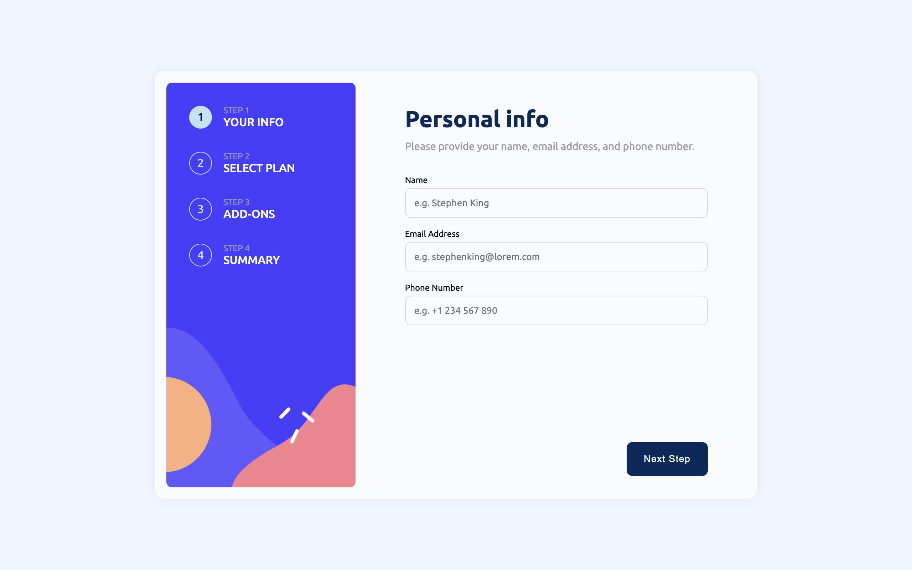

# Frontend Mentor - Multi-step form solution

This is a solution to the [Multi-step form challenge on Frontend Mentor](https://www.frontendmentor.io/challenges/multistep-form-YVAnSdqQBJ). Frontend Mentor challenges help you improve your coding skills by building realistic projects.

## Table of contents

- [Overview](#overview)
  - [The challenge](#the-challenge)
  - [Screenshot](#screenshot)
  - [Links](#links)
- [My process](#my-process)
  - [Built with](#built-with)
  - [What I learned](#what-i-learned)
  - [Continued development](#continued-development)
  - [Useful resources](#useful-resources)
- [Author](#author)
- [Acknowledgments](#acknowledgments)

## Overview

### The challenge

Users should be able to:

- Complete each step of the sequence
- Go back to a previous step to update their selections
- See a summary of their selections on the final step and confirm their order
- View the optimal layout for the interface depending on their device's screen size
- See hover and focus states for all interactive elements on the page
- Receive form validation messages if:
  - A field has been missed
  - The email address is not formatted correctly
  - A step is submitted, but no selection has been made

### Screenshot



### Links

- Solution: [Github](https://github.com/NandanGit/multi-step-form)
- Live Site: [Netlify](https://multistepform.nandanreddy.in/)

## My process

### Built with

- Semantic HTML5 markup
- Flexbox
- CSS Grid
- Desktop-first workflow
- [React](https://reactjs.org/) - JS library
- [SCSS](https://sass-lang.com) - For styles

### What I learned

I have experimented with SCSS for the first time while doing this project.
I am impressed with the way it works and how it makes the code more readable and maintainable. That was the main advantage I found while using SCSS.
All the other features like variables, mixins, nesting, etc. are also very useful.

Some of the code from the project:

```scss
// _variables.scss
$primary-1: hsl(213, 96%, 18%);
$gray-1: hsl(231, 11%, 63%);

// _mixins.scss
@mixin mobile {
	@media screen and (max-width: 768px) {
		@content;
	}
}

// _thank-you.scss
.ThankYou {
	width: 80%;
	margin: auto;
	text-align: center;
	img {
		margin-bottom: 1.5rem;
	}
	h1 {
		color: $primary-1;
		margin-bottom: 1rem;
	}
	p {
		color: $gray-1;
		font-size: 0.95rem;
	}
	@include mobile {
		width: 100%;
		margin: 2.5rem 0;
	}
}
```

The same code in CSS would look like this:

```css
.ThankYou {
	width: 80%;
	margin: auto;
	text-align: center;
}
.ThankYou img {
	margin-bottom: 1.5rem;
}
.ThankYou h1 {
	color: hsl(213, 96%, 18%);
	margin-bottom: 1rem;
}
.ThankYou p {
	color: hsl(231, 11%, 63%);
	font-size: 0.95rem;
}
@media screen and (max-width: 768px) {
	.ThankYou {
		width: 100%;
		margin: 2.5rem 0;
	}
}
```

This may not look like a lot of advantage at first glace, but when the project grows, the code will become more and more complex and difficult to maintain. That's where tools like SCSS comes in handy.

### Useful resources

- [MDN Web Docs](https://developer.mozilla.org/en-US/) - My goto website for any doubt regarding the basics of web.
- [SCSS Docs](https://sass-lang.com/documentation/) - Helped me to get comfortable enough with SCSS to use it in this project.

## Author

- Website - [Nandan](https://portfolio.nandanreddy.in/)
- Frontend Mentor - [@NandanGit](https://www.frontendmentor.io/profile/NandanGit)
